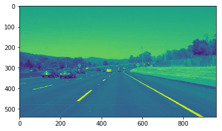
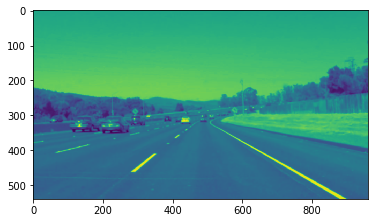
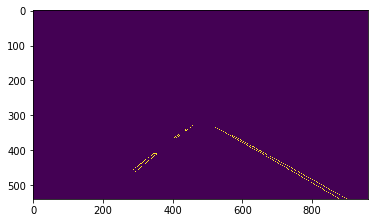
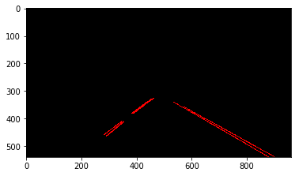
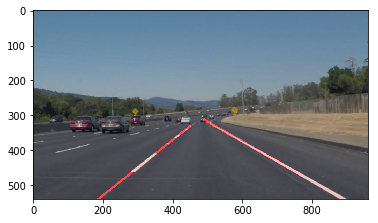

# **Finding Lane Lines on the Road**

---

**Finding Lane Lines on the Road**

The goals / steps of this project are the following:
* Make a pipeline that finds lane lines on the road
* Reflect on work

---

### Pipeline

The orignial image is shown above. My pipeline consisted of 6 steps as follows.

1. converted the images to grayscale  

2. applied gaussian smoothing 

3. detected edges 

4. created a masked edges image 

5. detected lines 

6. drew lines on the original image 

### Improvement on draw_lines() function
First, I identified all the segments on the left side and all the segments on the right side. Then I figured out two lines that fitted those segments, one for the left line and the other for the right line. With the modified draw_lines() function, the processed image would look like this. 

### Potential shortcomings with current pipeline

One potential shortcoming would be what would happen when the road is not straight, e.g. at detour or roundabout. Now the pipeline only handles straight lines.

Another shortcoming could be that when the lines are not clear or obvious it would be hard to tell where the lines are.

### Suggest possible improvements to the pipeline

A possible improvement would be to improve the line detection so that curves could be
found.

Another potential improvement could be enhancing the detected edges so that the pattern of lines are more obvious and can be easily detected.
